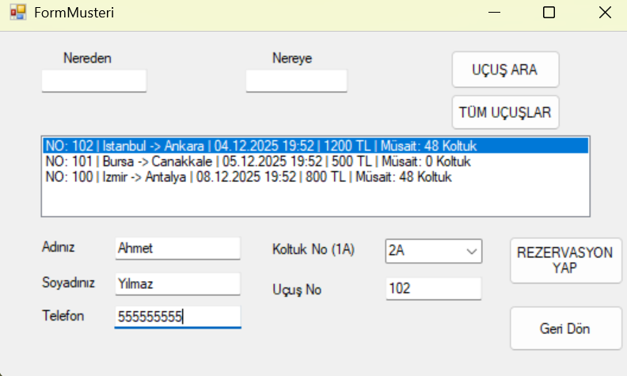

# Flight Reservation System (C# WinForms)

OOP dersi kapsamında geliştirdiğim basit bir Uçak Bileti Otomasyonu projesi.

###  Neler Yapıyor?
* Admin ve Müşteri girişleri.
* Uçuş ekleme, arama ve listeleme.
* Koltuk seçimi ve dinamik fiyat hesaplama.
* Miras alma (Inheritance) ve Çok biçimlilik (Polymorphism) örnekleri içerir.

###  Teknoloji
* C# / .NET Framework
* Windows Forms
* Veritabanı yok (Veriler RAM üzerinde `List` yapısında tutuluyor).

---
